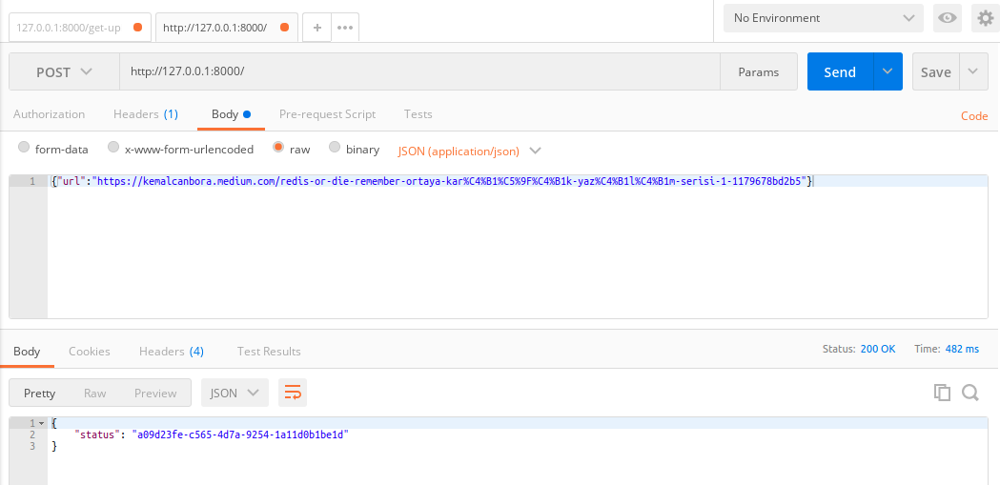

#Hit my Medium Story with robots!
 If you want to quickly go to the homepage, you can use it. This repo to increase the number of views of the article you wrote in medium.

# Chrome Driver
If you get chromedriver error you need to check your chrome browser on the settings and download chromedriver.

# Redis 
If you want to run this repo you need to have redis. 
 - Ways: 
    - Create account on https://app.redislabs.com/ and change settings REDIS_URL
    - Add redis files on the docker-compose


## Install 
 - pip install -r requirements.txt 
 - docker-compose build

## Start
 - <b>Terminal-0:</b> docker-compose up -d
 - <b>Terminal-1:</b> uvicorn main:app --reload
 - <b>Terminal-2:</b> python worker.py

# Tor Proxy
### Simple tor proxy exposed as docker containers

1. First you have to build docker ```docker-compose build``` 

2. Now you can up docker-compose ```docker-compose up```

3. Shut down the proxy after usage with ```docker-compose down```

4. Post URL to ```http://127.0.0.1:8000/```
 - Example:
    - <b>Method </b>: Post
    - <b>URL </b>: http://127.0.0.1:8000/
    - <b>Body </b>: ```{"url": "https://kemalcanbora.medium.com/redis-or-die-remember-ortaya-kar%C4%B1%C5%9F%C4%B1k-yaz%C4%B1l%C4%B1m-serisi-1-1179678bd2b5"}```
    



